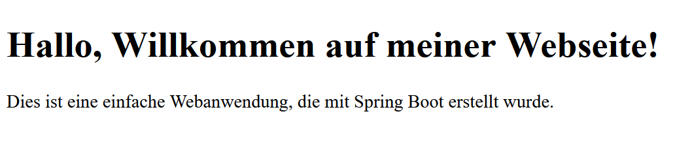

# First Website Written in Java

## Overview
This project is a simple web page created using Java. It demonstrates how Java can be used for web development.

## Preview

## Features
- Built using Java
- Basic web page structure
- Demonstrates Java web development concepts

## Usage
1. Start the server.
2. Open a web browser and navigate to `http://localhost:8080`.

